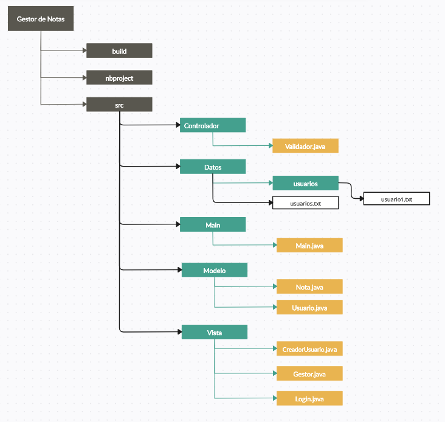
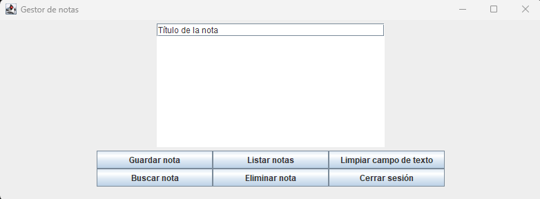
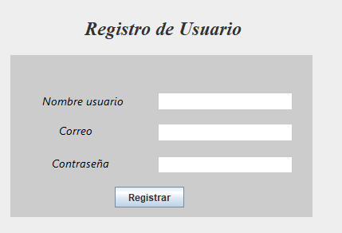

# Actividad_Evaluacion_UT5

Extender la aplicación Creador de Notas Interactivo para que los usuarios puedan guardar sus notas de forma persistente, organizadas por usuario, y acceder a ellas mediante un sistema de inicio de sesión y registro con control de errores.

# Webgrafía utilizada

    - Stackoverflow
    - Gitub
    - Muchos videos de Youtube

# Herramientas utilizadas

     - Visual Studio Code
     - Apache Netbeans
     - IA (sin mucho exito)
    
# Requisitos para su uso

    - Visual Studio Code
    - Jdk-23

# Estructura de carpetas

Para este proyecto nos centraremos en las carpetas contenidas en el source (src)

Controlador:
        En ella guardamos Validador.java, encargado de transformar las contraseñas y el inicio de sesión
    
Datos:
    Guarda la estructura donde se guardan los usuarios con su contraseña (usuarios.txt) y una carpeta
    en la que se guardan las notas de los usuarios
    
Main:
    Usado para llamar a la ventana de login e iniciar la aplicación
    
Modelo:
    Guarda las estructuras de Nota y Usuario, que son usadas en la lógica del gestor
    
Vista:
    Posee las 3 ventanas principales del proyecto
     - El login
     - El registro de usuario
     - El gestor de notas

# Prestaciones del proyecto

Pantalla de inicio de sesión

Pantalla de registro de usuario

Pantalla de gestor actualizada

# Pruebas de funcionamiento

Para las pruebas de funcionamiento he decidido centrarme en dos casos: 

- Un usuario ya existente y con notas
- Un usuario novel que no esta registrado

  
# # Caso 1: Usuario existente en el sistema y con alguna nota

En esta ocasión el usuario se llamará daniel@gmail.com u su contraseña sera 1234
Al iniciar la aplicación meteremos nuestros datos al sistema y haremos click en el boton Inicar sesión

Para la prueba introducire primero 123, es decir una contraseña incorrecta, esto nos devolvera un mensaje de error

Ahora la contraseña correcta. Nos devolvera la validacion.

Tras ello se nos abrirá el administrador de notas
Una vez en el, primero comprobemos las notas de daniel. En su txt vemos dos notas existentes

En el gestor haciendo click, en listar notas vemos los titulos de estas:

Si quisieramos ver el contenido de una de ellas, lo conseguiriamos con el boton de buscar
Este nos abrira una ventana en la que escribir el titulo de la Nota. Una vez escrito si se encuentra,
está se abrira en una nueva ventana

Ahora supongamos que queremos borrar la primera nota, para ello el botn de eliminar abrira una pestaña
en la que se mostrara los titulos de las notas. Seleccionando una de ellas y pulsando el boton inferior la eliminara
En este caso borraremos la primera de ellas (Prueba1).

Comprobando el archivo txt, veremos que ya no existe

Por último, al pulsar el boton cerrar sesión la ventana del gestor se cerrara y volveremos al Login

# # Caso 2: Usuario no existente en el sistema

Esta vez nuestro usuario no existe en el sistema. Lo llamaremos Pepe.
Desde la ventana del login, haremos click en el boton Registrarse, abriendo la ventana de registro

Pepe algo distraido hace click directamente en el boton de registro, saltando un error

Tras ello Pepe empieza a rellenar los campos pero se equivoca en el email, saltando otro error

Por último, pepe introduce una contraseña muy corta dando otro error

Tras introducir todos los datos correctamente, el usuario es registrado

Comprobemos que inicia sesión

